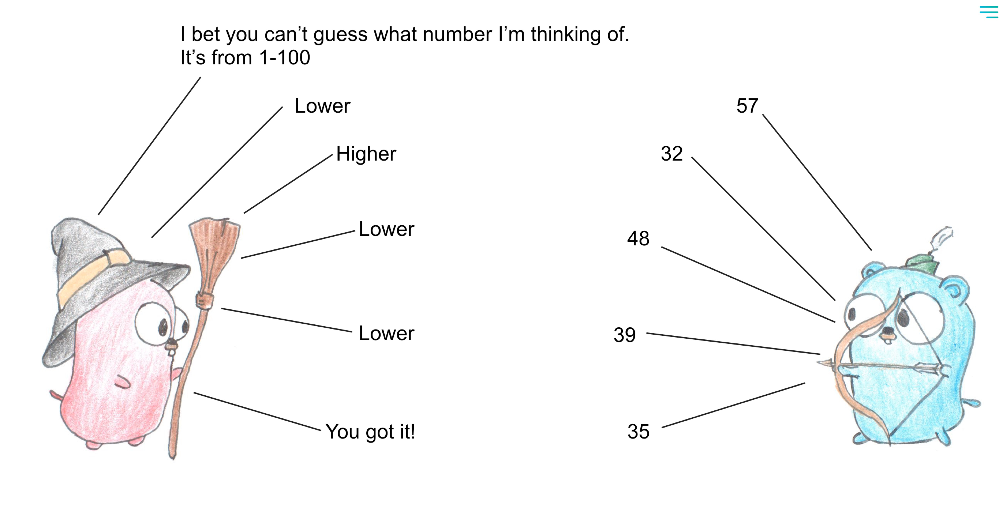

# Leetcode
<p align='left'>

</p>

[](https://golang.org/)
[](https://pkg.go.dev/github.com/mind1949/leetcode?tab=doc)
[](https://goreportcard.com/report/github.com/mind1949/leetcode) 
[](https://leetcode-cn.com/u/mind1949/)

My solutions to [leetcode](https://leetcode-cn.com/) problems.

# Structure

```
algs
├── 0001.thought.md  // 思路、正确性证明、复杂度分析
├── 0001.two_sum.go // 实现代码
└── 0001.two_sum_test.go // 测试代码
```

# Run Test
`make test`